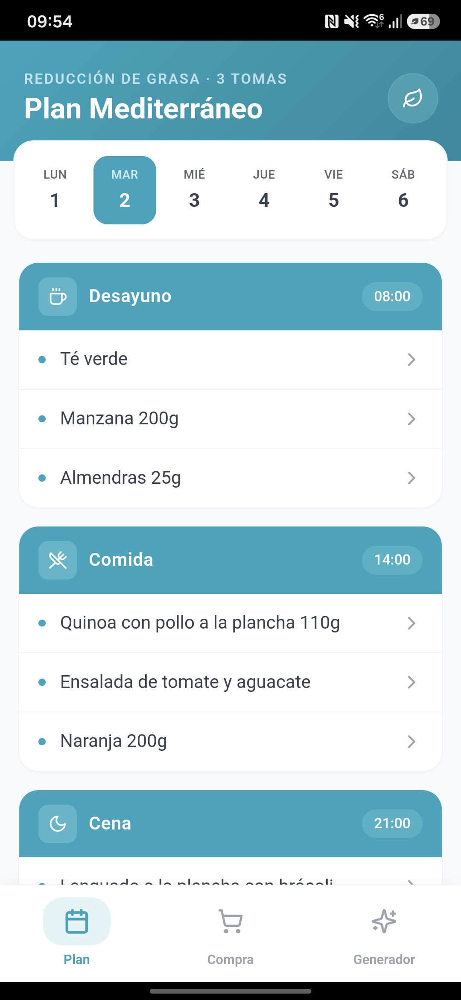
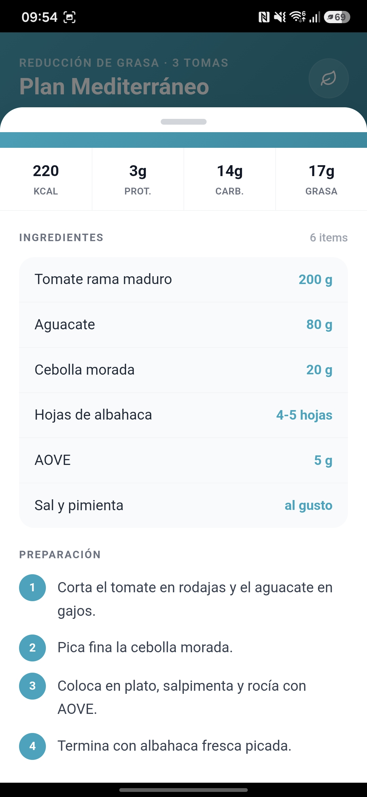
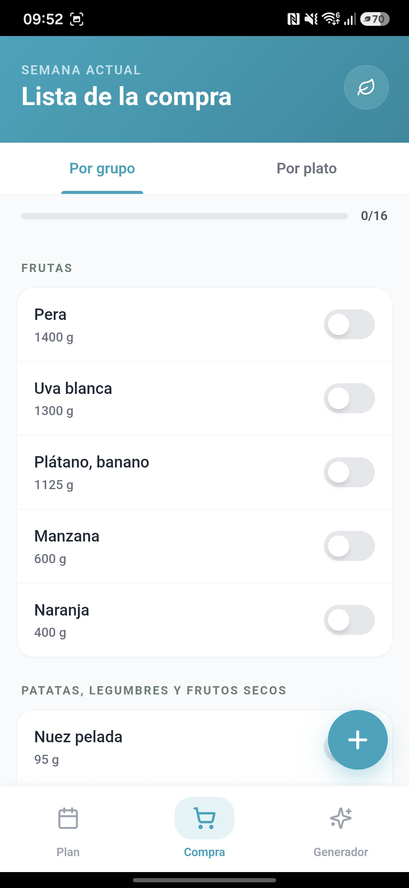
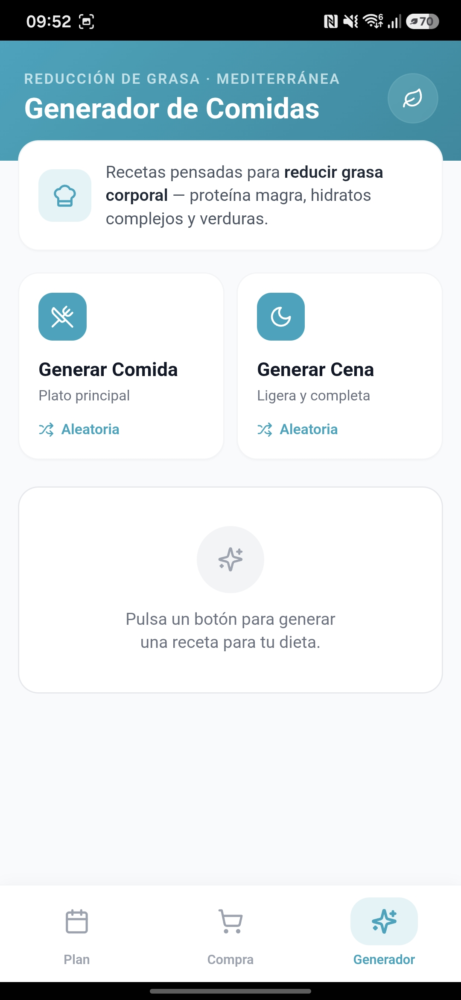

# NutriPlan

<p align="center">
  
  
  
  
  
  
</p>

> Plan nutricional mediterráneo. PWA instalable + APK Android. Mobile-first, offline-ready, sin tracking ni cuentas.

<p align="center">
  
  
  
  
</p>

## ✨ Qué hace

- **Plan semanal** con 3 tomas/día (desayuno, comida, cena) sobre dieta mediterránea de reducción de grasa.
- **Detalle de cada plato** al pulsar: ingredientes con gramajes precisos, macros (kcal/proteína/carbohidratos/grasa), tiempo, dificultad y preparación paso a paso. ~35 recetas escritas con técnicas reales (concassé, brunoise, tiempos por lado, temperaturas).
- **Lista de la compra** con dos vistas (por grupo de alimento / por plato), toggles por ingrediente, barra de progreso y reset.
- **Generador aleatorio** de comidas y cenas con macros equilibradas para el perfil del plan.
- **PWA instalable** en Android/iOS/escritorio. Funciona offline tras la primera carga.
- **APK nativo** generable con Capacitor para instalar sin Play Store.

## 🛠 Stack

- **Frontend:** React 18, Tailwind CSS 3, lucide-react
- **Bundler:** Vite 5
- **PWA:** vite-plugin-pwa con Workbox (StaleWhileRevalidate)
- **Packaging Android:** Capacitor 6

## 🚀 Ejecutar en local

```bash
npm install
npm run dev          # desarrollo con hot reload
npm run build        # build de producción → dist/
npm run preview      # servir el build en red local
```

Una vez en `preview`, abre la IP de red que muestra Vite desde tu móvil (mismo WiFi) y "Añadir a pantalla de inicio" desde Chrome — queda instalada como PWA.

## 📱 Generar el APK

Pre-configurado con Capacitor. Requiere Android Studio (SDK) y JDK 21.

```bash
npm run build
npx cap add android
npm install -D @capacitor/assets
npx @capacitor/assets generate --android
npx cap sync
npm run apk
```

APK en: `android/app/build/outputs/apk/debug/app-debug.apk`

Guía completa en [`GUIA-APK.md`](./GUIA-APK.md), con ambas rutas (Capacitor local y PWABuilder online), instalación en el móvil y troubleshooting.

## 🧱 Decisiones de diseño que merece la pena destacar

- **Persistencia por IDs, no por estructura.** El estado de la lista de la compra guarda solo los IDs de los productos marcados, no el objeto completo. Esto hace que el dato persistido sobreviva a cambios futuros del plan: si añades un producto nuevo, aparece desmarcado automáticamente sin romper nada.
- **`usePersistedState` defensivo.** Hook que detecta con try/catch si `localStorage` está disponible (puede no estarlo en modo incógnito, Safari restrictivo o sandboxes). Degrada con gracia a estado en memoria.
- **Bottom sheet iOS-like.** Animación con `cubic-bezier(0.32, 0.72, 0, 1)`, handle visual, bloqueo de scroll del body, backdrop con fade y respeto al `safe-area-inset-bottom` para iPhones con notch.
- **Búsqueda de recetas por keyword.** El plan guarda los platos como string (`"Quinoa con pollo a la plancha 110g"`), y el sistema mapea a la receta detallada por substring de palabras clave. Permite que el mismo plato aparezca con diferentes gramajes y comparta receta.
- **Iconos PWA generados programáticamente** con PIL (Python): hoja almendrada vesica-piscis con nervadura, fondo turquesa con gradiente diagonal. Variantes para Android adaptive icons (foreground/background/maskable), iOS y favicon.

## 📂 Estructura

```
nutriplan/
├── public/              # iconos PWA, manifest, favicon
├── assets/              # fuentes 1024px para @capacitor/assets
├── src/
│   ├── App.jsx          # toda la app (vistas, modal, persistencia, recetas)
│   ├── main.jsx
│   └── index.css        # tailwind directives
├── docs/                # capturas para el README
├── capacitor.config.json
├── vite.config.js       # plugin PWA con Workbox
└── tailwind.config.js
```

## 📜 Licencia

MIT — ver [`LICENSE`](./LICENSE).
